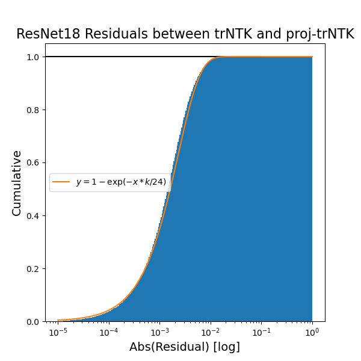
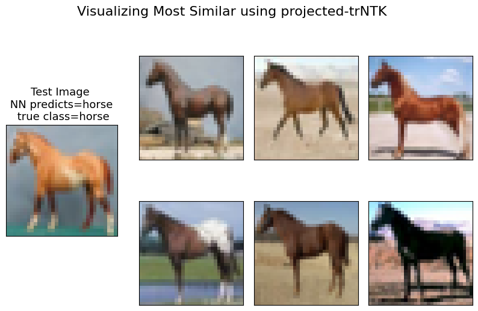

[](https://arxiv.org/abs/2305.14585)

# Projection NTK

In our [paper](https://arxiv.org/abs/2305.14585), we introduce projection varients of approximate neural tangent kernel (NTK).
These NTK are computed from inner products of Jacobians of neural network models. They benefit from the insight made in Park 2023 (TRAK), long vectors will retain most of their relative information when projected down to a smaller feature dimension. We can utilize this to reduce the scaling with number of parameters in NTK computation, and infact, can tune the computational scaling by choosing the projection dimension. We observed that for a 1000x reduction via random projection in number of model parameters on ResNet18, we could calculate an approximate NTK called the projection trace-NTK, that was promising as a surrogate model for the original neural network and whose residuals with respect to the full trace-NTK fell away exponentially, see figure below.



These projections enable calculating approximate NTK for large models and large datasets
faster than ever before; with a few tweaks to the underlying TRAK module enables PyTorch users to 
evaluate how close their own neural network models are to kernel machines. In addition, the speed and memory
savings should open-up exciting new applciations for NTK research. One application we demonstrate is to find
the top most similar images for any test image, see below and in paper for more examples.



## Usage

We provide a rough sketch of usage to calculate the projection-trNTK of a neural network model on Cifar10.

### Make a `TRAKer` instance

```python
from trak import TRAKer

#PyTorch nn.Module object
model = ...

#this is a common state dictionary file for model
checkpoint = torch.load('./checkpoint.pt') 

#we want a dataloader object that combines BOTH train and test data, with shuffle=False
train_and_test_loader = ...
Ndata = len(train_and_test_loader.dataset)

#set the projection dimension. we used K=10240 for a ResNet18 with 11e6 model
#parameters. There is assumedly a computation/accuracy tradeoff for K, that probably
#is in some ratio to number of model parameters. 
K=10_240

#currently hacky-- if the combined size of example in train_and_test_loader = ABC then:
traker = TRAKer(model=model, task='pNTK', train_set_size=Ndata, projection_dim=K)
```

### Compute Jacobians of neural network model

```python

traker.load_checkpoint(checkpoint, model_id=0)
for batch in train_and_test_loader:
  # batch should be a tuple of inputs and labels
  traker.featurize(batch=batch, ...)
#this saved a memmap object of the projected gradients to disk.
```

### Compute NTK via Jacobian Contraction

```python

A = torch.from_numpy(np.load('./path/to/0/grads.memmap')).cuda()
NTK = torch.matmul(A,A.T) #NTK has dimensions Ndata x Ndata
```

## Installation

We advise installing TRAK V0.2.1, then clone our repository and install locally.

To install TRAK with `CUDA` kernel for fast gradient projection, follow the installation instructions at
[installation FAQs](https://trak.readthedocs.io/en/latest/install.html). You will need compatible versions
of `gcc` and `CUDA toolkit`. 

```
pip install traker[fast]==0.2.1

git clone <this_repo>
cd <./this_repo>
pip install -e ./
```
We have additional dependecies:
```
pip install einops
```
specific experiments may also utilize additional depencies; but this should allow users to begin with the ./projectionNTK_examples/

## Examples
You can find an end-to-end example in the `projectionNTK_examples/` directory, including how to calcualte the top-5 most similar images.
Additional notebooks and scripts describing our experiments are available in ./experiments and ./scripts
Due to github large file size limitations we do not provide pre-computed NTK; we're actively looking for a solution that would allow
users to download the objects we computed. NTK would be 14.4GB for Cifar10.

## Credit
Much credit is owed to the original TRAK repostory, of which this repo is a fork. The goal for this repository is to make our work reproducible, we would like to merge the capabilities enabled by our changes back into TRAK. Please see [TRAK paper](https://arxiv.org/abs/2303.14186) for more details. 

## Citation
If you use the capabilities developed to compute approximate NTK, consider citing our work!
```
@misc{engel2023robust,
      title={Robust Explanations for Deep Neural Networks via Pseudo Neural Tangent Kernel Surrogate Models}, 
      author={Andrew Engel and Zhichao Wang and Natalie S. Frank and Ioana Dumitriu and Sutanay Choudhury and Anand Sarwate and Tony Chiang},
      year={2023},
      eprint={2305.14585},
      archivePrefix={arXiv},
      primaryClass={cs.LG}
}
```
You should also cite the original TRAK repository:
```
@inproceedings{park2023trak,
  title = {TRAK: Attributing Model Behavior at Scale},
  author = {Sung Min Park and Kristian Georgiev and Andrew Ilyas and Guillaume Leclerc and Aleksander Madry},
  booktitle = {International Conference on Machine Learning (ICML)},
  year = {2023}
}
```

# Disclaimer

This computer software was prepared by Battelle Memorial Institute, hereinafter the Contractor, under Contract No. DE-AC05-76RL0 1830 with the Department of Energy (DOE). All rights in the computer software are reserved by DOE on behalf of the United States Government and the Contractor as provided in the Contract. 

This material was prepared as an account of work sponsored by an agency of the United States Government. Neither the United States Government nor the United States Department of Energy, nor the Contractor, nor any of their employees, nor any jurisdiction or organization that has cooperated in the development of these materials, makes any warranty, express or implied, or assumes any legal liability or responsibility for the accuracy, completeness, or usefulness or any information, apparatus, product, software, or process disclosed, or represents that its use would not infringe privately owned rights.

Reference herein to any specific commercial product, process, or service by trade name, trademark, manufacturer, or otherwise does not necessarily constitute or imply its endorsement recommendation, or favoring by the United States Government or any agency thereof, or Battelle Memorial Institute. The views and opinions of authors expressed herein do not necessarily state or reflect those of the United States Government or any agency thereof.

PACIFIC NORTHWEST NATIONAL LABORATORY operated by BATTELLE for the UNITED STATES DEPARTMENT OF ENERGY under Contract DE-AC05-76RL01830